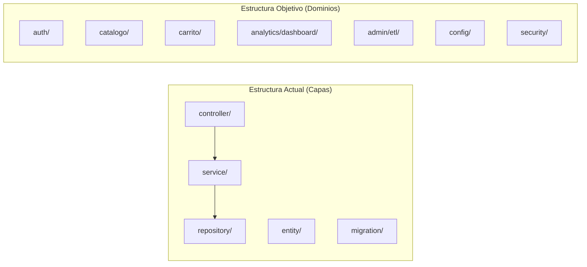
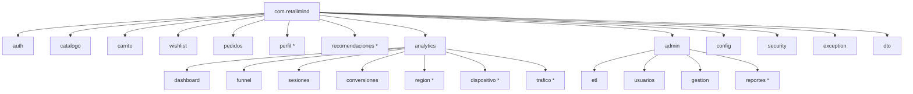
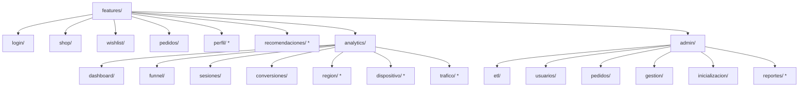
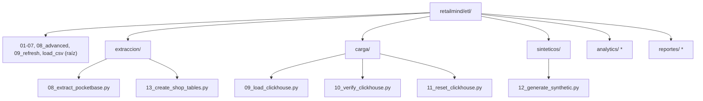
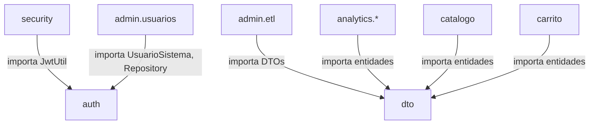

# Design Document: RetailMind Package Reorganization

## Overview

Este diseño describe la migración de la estructura del monorepo RetailMind desde una organización plana por capas técnicas (controller/, service/, repository/) hacia una estructura modular por dominios funcionales. La reorganización abarca los tres sub-proyectos: Backend Java (Spring Boot), Frontend Angular 17, y ETL Python.

**Objetivo principal**: Mejorar la cohesión del código agrupando clases relacionadas por dominio de negocio, facilitando el mantenimiento y preparando la base para módulos futuros (semanas 4-6).

**Principio clave**: La reorganización es puramente estructural — no se modifica lógica de negocio, solo se mueven archivos y se actualizan declaraciones de paquetes, imports y rutas.

### Decisiones de Diseño

1. **Spring Boot Component Scan automático**: `@SpringBootApplication` en `com.retailmind` escanea automáticamente todos los sub-paquetes. No se requiere configuración adicional de `@ComponentScan`.
2. **Angular standalone components**: Al usar componentes standalone con lazy loading, solo se necesita actualizar las rutas de importación en `app.routes.ts`.
3. **ETL Python sub-packages**: Se crean `__init__.py` en cada sub-directorio para mantener la importabilidad como paquetes Python.
4. **Orden de ejecución**: Backend primero (más complejo), luego Frontend, luego ETL, y finalmente las referencias cruzadas.

## Architecture

### Estructura Actual vs. Estructura Objetivo



### Diagrama de Paquetes Backend Objetivo



*\* = placeholder (package-info.java solamente)*

### Diagrama de Estructura Frontend Objetivo



*\* = placeholder (README.md solamente)*

### Diagrama de Estructura ETL Objetivo



*\* = placeholder (README.md + \_\_init\_\_.py solamente)*

## Components and Interfaces

### Backend: Mapeo de Archivos por Paquete Destino

| Paquete Destino | Archivos |
|---|---|
| `com.retailmind` (raíz) | `RetailmindApplication.java` |
| `com.retailmind.auth` | `AuthController.java`, `AuthService.java`, `ClickHouseUserRepository.java`, `JwtUtil.java`, `DataInitializer.java`, `UsuarioSistema.java` |
| `com.retailmind.catalogo` | `ProductoCatalogoController.java`, `ProductoCatalogoService.java` |
| `com.retailmind.carrito` | `CarritoController.java`, `CarritoService.java` |
| `com.retailmind.wishlist` | `WishlistController.java`, `WishlistService.java` |
| `com.retailmind.pedidos` | `PedidosController.java`, `PedidosService.java` |
| `com.retailmind.analytics.dashboard` | `DashboardController.java`, `DashboardService.java` |
| `com.retailmind.analytics.funnel` | `FunnelController.java`, `FunnelService.java` |
| `com.retailmind.analytics.sesiones` | `SesionController.java`, `SesionService.java` |
| `com.retailmind.analytics.conversiones` | `ConversionController.java`, `ConversionService.java` |
| `com.retailmind.admin.etl` | `InicializacionController.java`, `EtlController.java`, `EtlService.java` |
| `com.retailmind.admin.usuarios` | `UsuariosAdminController.java`, `UsuariosAdminService.java` |
| `com.retailmind.admin.gestion` | `GestionDatosController.java`, `GestionDatosService.java` |
| `com.retailmind.config` | `ClickHouseConfig.java`, `CorsConfig.java`, `HealthController.java`, `HealthCheckService.java` |
| `com.retailmind.security` | `SecurityConfig.java`, `JwtAuthenticationFilter.java` |
| `com.retailmind.exception` | `GlobalExceptionHandler.java` |
| `com.retailmind.dto` | 11 archivos DTO (sin cambios de ubicación) |

#### Archivos de Entidad y Repositorio (asignación por dominio)

| Archivo | Paquete Destino | Justificación |
|---|---|---|
| `UsuarioSistema.java` | `com.retailmind.auth` | Entidad usada exclusivamente por auth |
| `ClickHouseUserRepository.java` | `com.retailmind.auth` | Repositorio del usuario de sistema |
| `DimCanal.java`, `DimCategoria.java`, `DimDispositivo.java`, `DimRegion.java`, `FactEvento.java` | `com.retailmind.dto` | Entidades compartidas por múltiples dominios (analytics, dashboard) |
| `DimCanalRepository.java`, `FactEventoRepository.java` | `com.retailmind.dto` | Repositorios de entidades compartidas |

### Backend: Paquetes Placeholder (package-info.java)

| Paquete | Contenido |
|---|---|
| `com.retailmind.perfil` | `/** Paquete perfil - Gestión de perfil de usuario - Pendiente Semana 4 */` |
| `com.retailmind.recomendaciones` | `/** Paquete recomendaciones - Motor de recomendaciones de productos - Pendiente Semana 4 */` |
| `com.retailmind.analytics.region` | `/** Paquete region - Análisis por región geográfica - Pendiente Semana 5 */` |
| `com.retailmind.analytics.dispositivo` | `/** Paquete dispositivo - Análisis por tipo de dispositivo - Pendiente Semana 5 */` |
| `com.retailmind.analytics.trafico` | `/** Paquete trafico - Análisis por fuente de tráfico - Pendiente Semana 5 */` |
| `com.retailmind.admin.reportes` | `/** Paquete reportes - Generación de reportes administrativos - Pendiente Semana 6 */` |

### Frontend: Mapeo de Rutas Actualizadas

| Ruta | Import Actual | Import Nuevo |
|---|---|---|
| `dashboard` | `./features/dashboard/dashboard.component` | `./features/analytics/dashboard/dashboard.component` |
| `funnel` | `./features/funnel/funnel.component` | `./features/analytics/funnel/funnel.component` |
| `sesiones` | `./features/sesiones/sesiones-list.component` | `./features/analytics/sesiones/sesiones-list.component` |
| `conversiones` | `./features/conversiones/conversiones-list.component` | `./features/analytics/conversiones/conversiones-list.component` |
| `admin-etl` | `./features/admin-etl/admin-etl.component` | `./features/admin/etl/admin-etl.component` |
| `admin-usuarios` | `./features/admin-usuarios/admin-usuarios.component` | `./features/admin/usuarios/admin-usuarios.component` |
| `admin-pedidos` | `./features/admin-pedidos/admin-pedidos.component` | `./features/admin/pedidos/admin-pedidos.component` |
| `gestion-datos` | `./features/gestion-datos/gestion-datos.component` | `./features/admin/gestion/gestion-datos.component` |
| `inicializacion` | `./features/inicializacion/inicializacion.component` | `./features/admin/inicializacion/inicializacion.component` |

**Rutas sin cambios**: `login`, `shop`, `shop/producto/:id`, `shop/carrito`, `wishlist`, `mis-pedidos`

### ETL: Mapeo de Scripts a Sub-directorios

| Script | Directorio Destino |
|---|---|
| `08_extract_pocketbase.py` | `etl/extraccion/` |
| `13_create_shop_tables.py` | `etl/extraccion/` |
| `09_load_clickhouse.py` | `etl/carga/` |
| `10_verify_clickhouse.py` | `etl/carga/` |
| `11_reset_clickhouse.py` | `etl/carga/` |
| `12_generate_synthetic.py` | `etl/sinteticos/` |

**Scripts que permanecen en raíz**: `01` a `07`, `08_apply_advanced_optimize.py`, `09_create_refresh_function.py`, `load_csv_staging.py`

### Backend: Actualización de ProcessBuilder Paths

| Referencia Actual | Referencia Nueva |
|---|---|
| `etl/08_extract_pocketbase.py` | `etl/extraccion/08_extract_pocketbase.py` |
| `etl/09_load_clickhouse.py` | `etl/carga/09_load_clickhouse.py` |
| `etl/10_verify_clickhouse.py` | `etl/carga/10_verify_clickhouse.py` |
| `etl/11_reset_clickhouse.py` | `etl/carga/11_reset_clickhouse.py` |
| `etl/12_generate_synthetic.py` | `etl/sinteticos/12_generate_synthetic.py` |
| `etl/13_create_shop_tables.py` | `etl/extraccion/13_create_shop_tables.py` |

## Data Models

No se modifican modelos de datos. Las entidades JPA, DTOs y tablas de base de datos permanecen idénticos en estructura y contenido. Solo cambian las declaraciones de paquete (`package` statement) y las rutas de importación.

### Impacto en Imports

Los cambios de imports siguen un patrón predecible:

```java
// Antes
import com.retailmind.controller.AuthController;
import com.retailmind.service.AuthService;
import com.retailmind.repository.ClickHouseUserRepository;

// Después
import com.retailmind.auth.AuthController;
import com.retailmind.auth.AuthService;
import com.retailmind.auth.ClickHouseUserRepository;
```

### Dependencias entre Paquetes (Post-reorganización)



## Correctness Properties

*A property is a characteristic or behavior that should hold true across all valid executions of a system — essentially, a formal statement about what the system should do. Properties serve as the bridge between human-readable specifications and machine-verifiable correctness guarantees.*

Note: PBT (property-based testing with randomized inputs) is **not applicable** to this feature. This is a purely structural reorganization — no new business logic, parsers, serializers, or algorithms are being implemented. The acceptance criteria verify deterministic, binary outcomes (file exists at path or not, compilation succeeds or fails, package declaration matches directory or not). There is no variable input space where generating random inputs would reveal additional defects. The properties below are structural invariants verified through deterministic checks (compilation, file existence).

### Property 1: Structural integrity after reorganization

*For any* Java source file moved to a new package directory, the `package` declaration at the top of the file SHALL match the directory path relative to `src/main/java/`, and the project SHALL compile successfully with zero unresolved imports.

**Validates: Requirements 1.2, 1.3, 2.2, 2.3, 2.4, 3.5, 3.6, 13.1**

### Property 2: Component scan completeness

*For any* class annotated with `@Component`, `@Service`, `@RestController`, or `@Configuration` in any sub-package of `com.retailmind`, Spring Boot's automatic component scan SHALL detect and register it as a bean without requiring explicit `@ComponentScan` configuration.

**Validates: Requirements 1.5, 13.3**

### Property 3: Frontend route resolution

*For any* lazy-loaded route defined in `app.routes.ts`, the `loadComponent` import path SHALL resolve to an existing component file at the specified location, and `ng build` SHALL produce zero module-not-found errors.

**Validates: Requirements 9.1, 9.2, 9.4, 9.5**

### Property 4: ETL script path consistency

*For any* ProcessBuilder reference in `InicializacionController.java`, the referenced script path SHALL correspond to an existing Python file in the ETL directory structure, and execution SHALL not produce a file-not-found error.

**Validates: Requirements 12.1, 12.2, 12.3, 12.4, 12.5, 12.7**

## Error Handling

### Estrategia de Migración Segura

1. **Compilación incremental**: Después de mover cada grupo de archivos (por dominio), ejecutar `mvn clean compile` para detectar imports rotos inmediatamente.
2. **Rollback por dominio**: Si un módulo falla en compilación, revertir solo ese módulo sin afectar los demás.
3. **ProcessBuilder fallback**: Si un script ETL no se encuentra en la nueva ruta, `InicializacionController` ya retorna `success=false` con mensaje descriptivo — este comportamiento se preserva.

### Riesgos y Mitigaciones

| Riesgo | Mitigación |
|---|---|
| Import circular entre paquetes | Las dependencias fluyen en una dirección: dominio → dto/config |
| Component Scan no detecta beans | `@SpringBootApplication` en `com.retailmind` escanea todos los sub-paquetes automáticamente |
| Lazy import paths rotos en Angular | Verificar con `ng build` que todos los paths resuelven |
| Scripts ETL con imports relativos rotos | Ejecutar cada script desde el directorio raíz del proyecto |
| JwtUtil movido a auth pero usado por security | Actualizar import en `JwtAuthenticationFilter.java` a `com.retailmind.auth.JwtUtil` |

### Orden de Ejecución Recomendado

1. Crear estructura de directorios (paquetes vacíos)
2. Mover archivos de infraestructura (config, security, exception, dto) — ya están en su lugar
3. Mover módulo auth (6 archivos)
4. Mover módulos de negocio (catalogo, carrito, wishlist, pedidos)
5. Mover módulo analytics (8 archivos + 3 placeholders)
6. Mover módulo admin (7 archivos + 1 placeholder)
7. Crear placeholders de módulos futuros (perfil, recomendaciones)
8. Eliminar directorios vacíos originales (controller/, service/, repository/, entity/, migration/)
9. Reorganizar frontend (mover componentes, actualizar app.routes.ts)
10. Reorganizar ETL (mover scripts, crear __init__.py)
11. Actualizar ProcessBuilder paths en InicializacionController
12. Verificación final (mvn clean compile, ng build, ejecución de scripts)

## Testing Strategy

### Por qué NO se aplica Property-Based Testing

Esta feature es una **reorganización estructural** — no implementa lógica de negocio nueva, parsers, serializers, ni algoritmos. Los criterios de aceptación verifican que:
- Archivos específicos existen en rutas específicas
- Declaraciones de paquete coinciden con la ruta del directorio
- Imports se resuelven correctamente
- La compilación es exitosa

Estas son verificaciones determinísticas con resultados binarios (existe/no existe, compila/no compila). No hay un espacio de inputs variable donde PBT aportaría valor.

### Estrategia de Testing

#### Smoke Tests (Compilación)

| Test | Comando | Criterio de Éxito |
|---|---|---|
| Backend compila | `mvn clean compile` | Exit code 0, zero errors |
| Frontend compila | `ng build` | Exit code 0, zero errors |
| Backend tests pasan | `mvn test` | Exit code 0, zero failures |
| Spring context carga | `mvn spring-boot:run` (verificar startup) | Application context loads |

#### Example-Based Tests (Verificación de Estructura)

1. **Verificar que archivos existen en destino**: Para cada archivo listado en el mapeo, confirmar que existe en la ruta nueva.
2. **Verificar package declarations**: Para cada archivo Java movido, confirmar que la primera línea `package` coincide con la ruta del directorio.
3. **Verificar imports resueltos**: Compilación exitosa implica que todos los imports son válidos.
4. **Verificar directorios originales vacíos/eliminados**: Confirmar que `controller/`, `service/`, `repository/`, `entity/`, `migration/` no contienen archivos Java.
5. **Verificar lazy imports en app.routes.ts**: Confirmar que cada path de importación apunta a un archivo existente.
6. **Verificar ProcessBuilder paths**: Confirmar que cada ruta referenciada en `InicializacionController.java` apunta a un script existente.

#### Integration Tests

1. **ETL script execution**: Ejecutar cada script movido desde el directorio raíz y verificar que no produce `ModuleNotFoundError`.
2. **Backend API health**: Después del startup, verificar que `/api/init/*` endpoints responden correctamente.
3. **Frontend routing**: Verificar que la navegación a cada ruta carga el componente esperado.

### Criterios de Aceptación de la Verificación

- `mvn clean compile` → exit code 0
- `mvn test` → exit code 0, zero failures
- `ng build` → exit code 0, zero errors
- Cada script ETL movido ejecuta sin `ModuleNotFoundError`
- `InicializacionController` ejecuta scripts en las nuevas rutas correctamente
